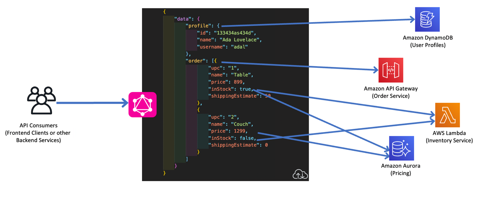

<div align = "center">
  <h1> API Architecture Patterns </h1>
</div>

<div align = "center">
  
</div>

<hr>

## Table of Contents

- [What is the Difference Between GraphQL and REST?](#what-is-the-difference-between-graphql-and-rest)
- [What are the similarities between GraphQL and REST?](#what-are-the-similarities-between-graphql-and-rest)
- [What REST limitations does GraphQL attempt to overcome?](#what-rest-limitations-does-graphql-attempt-to-overcome)
- [Key differences between GraphQL and REST](#key-differences-between-graphql-and-rest)
- [When to use GraphQL vs. REST](#when-to-use-graphql-vs-rest)
- [How to use both GraphQL and REST over the same API](#how-to-use-both-graphql-and-rest-over-the-same-api)
- [Summary of differences: REST vs GraphQL](#summary-of-differences-rest-vs-graphql)
- [How can AWS support your GraphQL and REST requirements?](#how-can-aws-support-your-graphql-and-rest-requirements)
- Architecture Patterns

  - REST

    - [What is a RESTful API?](#what-is-a-restful-api)
    - [What is an API?](#what-is-an-api)
    - [What is REST?](#what-is-rest)
    - [What are the benefits of RESTful APIs?](#what-are-the-benefits-of-restful-apis)
    - [How do RESTful APIs work?](#how-do-restful-apis-work)
    - [What does the RESTful API client request contain?](#what-does-the-restful-api-client-request-contain)
    - [What are RESTful API authentication methods?](#what-are-restful-api-authentication-methods)
    - [What does the RESTful API server response contain?](#what-does-the-restful-api-server-response-contain)
    - [How can AWS help you with RESTful API management?](#how-can-aws-help-you-with-restful-api-management)

  - GraphQL
    - [Introduction](https://graphql.org/learn/)
    - [Queries and Mutations](https://graphql.org/learn/queries/)
      - [Fields](https://graphql.org/learn/queries/#fields)
      - [Arguments](https://graphql.org/learn/queries/#arguments)
      - [Aliases](https://graphql.org/learn/queries/#aliases)
      - [Fragments](https://graphql.org/learn/queries/#fragments)
      - [Operation name](https://graphql.org/learn/queries/#operation-name)
      - [Variables](https://graphql.org/learn/queries/#variables)
      - [Directives](https://graphql.org/learn/queries/#directives)
      - [Mutations](https://graphql.org/learn/queries/#mutations)
      - [Inline Fragments](https://graphql.org/learn/queries/#inline-fragments)
    - [Schemas and Types](https://graphql.org/learn/schema/)
      - [Type system](https://graphql.org/learn/schema/#type-system)
      - [Type language](https://graphql.org/learn/schema/#type-language)
      - [Object types and fields](https://graphql.org/learn/schema/#object-types-and-fields)
      - [Arguments](https://graphql.org/learn/schema/#arguments)
      - [The Query and Mutation types](https://graphql.org/learn/schema/#the-query-and-mutation-types)
      - [Scalar types](https://graphql.org/learn/schema/#scalar-types)
      - [Enumeration types](https://graphql.org/learn/schema/#enumeration-types)
      - [Lists and Non-Null](https://graphql.org/learn/schema/#lists-and-non-null)
      - [Interfaces](https://graphql.org/learn/schema/#interfaces)
      - [Union types](https://graphql.org/learn/schema/#union-types)
      - [Input types](https://graphql.org/learn/schema/#input-types)

Sources:

- [What’s the Difference Between GraphQL and REST?](https://aws.amazon.com/compare/the-difference-between-graphql-and-rest/)
- [Top 6 Most Popular API Architecture Styles You Need to Know (with Pros, Cons, and Use Cases) ](https://dev.to/kanani_nirav/top-6-most-popular-api-architecture-styles-you-need-to-know-with-pros-cons-and-use-cases-564j)

# What is the Difference Between GraphQL and REST?

GraphQL and REST are two distinct approaches to designing API for exchanging data over the internet. REST enables client applications to exchange data with a server using HTTP verbs, which is the standard communication protocol of the internet. On the other hand, GraphQL is an API query language that defines specifications of how a client application should request data from a remote server. You can use GraphQL in your API calls without relying on the server-side application to define the request. Both GraphQL and REST are powerful technologies behind most of our modern applications.

# What are the similarities between GraphQL and REST?

Both GraphQL and REST are popular API architecture styles that enable the exchange of data between different services or applications in a client-server model.

APIs facilitate the access of data and data operations like this:

    1. A client sends an API request to an endpoint or multiple endpoints on a server
    2. The server gives a response that contains data, data status, or error codes

REST and GraphQL allow you to create, modify, update, and delete data on a separate application, service, or module via API. APIs developed with REST are known as RESTful APIs or REST APIs. Those developed with GraphQL are simply GraphQL APIs.

Frontend and backend teams use these API architectures to create modular and accessible applications. Using an API architecture helps keep systems secure, modular, and scalable. It also makes systems more performant and easier to integrate with other systems.

### **Architecture**

Both REST and GraphQL implement several common API architectural principles. For example, here are principles they share:

    - Both are stateless, so the server does not save response history between requests
    - Both use a client-server model, so requests from a single client result in replies from a single server
    - Both are HTTP-based, as HTTP is the underlying communication protocol

### **Resource-based design**

REST and GraphQL both design their data interchange around resources. A resource refers to any data or object that the client can access and manipulate through the API. Each resource has its own unique identifier (URI) and a set of operations (HTTP methods) that the client can perform on it.

For example, consider a social media API where users create and manage posts. In a resource-based API, a post would be a resource. It has its own unique identifier, for example, /posts/1234. And it has a set of operations, such as GET to retrieve the post in REST or query to retrieve the post in GraphQL.

### **Data-exchange**

Both REST and GraphQL support similar data formats.

JSON is the most popular data exchange format that all languages, platforms, and systems understand. The server returns JSON data to the client. Other data formats are available but less commonly used, including XML and HTML.

Similarly, REST and GraphQL both support caching. So, clients and servers can cache frequently accessed data to increase speed of communication.

### **Language and database neutrality**

Both GraphQL and REST APIs work with any database structure and any programming language, both client-side and server-side. This makes them highly interoperable with any application.

# What REST limitations does GraphQL attempt to overcome?

GraphQL emerged in 2012 as a response to the need for speed in emerging social media platforms. Developers found that existing API architectures, like REST, were too lengthy and structured to produce news feeds efficiently.

Next, we discuss some of the challenges they faced.

### **Fixed-structure data exchange**

The REST API requires client requests to follow a fixed structure to receive a resource. This rigid structure is easy to use, but it’s not always the most efficient means to exchange exactly the data needed.

### **Overfetching and underfetching**

REST APIs always return a whole dataset. For example, from a person object in the REST API, you would receive the person’s name, date of birth, address, and phone number. You would get all of this data even if you only needed a phone number.

Similarly, if you wanted to know a person’s phone number and last purchase, you would need multiple REST API requests. The URL /person would return the phone number and the URL /purchase would return purchase history.

Social media developers had to write a lot of code just to process API requests, which affected performance and user experience.

GraphQL emerged as a query-based solution. Queries can return the exact data in only one API request and response exchange.

# Key differences between GraphQL and REST

A REST API is an architectural concept for application communication. On the other hand, GraphQL is a specification, an API query language, and a set of tools. GraphQL operates over a single endpoint using HTTP.

In addition, REST development has been more focused on making new APIs. Meanwhile, GraphQL’s focus has been on API performance and flexibility.

Next, we give some more differences.

### **Client-side request**

Here’s what a REST request uses to work:

    - HTTP verbs that determine the action
    - A URL that identifies the resource on which to action the HTTP verb
    - Parameters and values to parse, if you want to create or modify an object within an existing server-side resource

For example, you use GET to get read-only data from a resource, POST to add a new resource entry, or PUT to update a resource.

In contrast, here’s what GraphQL requests use:

    - Query for getting read-only data
    - Mutation for modifying data
    - Subscription to receive event-based or streaming data updates

A data format describes how you would like the server to return the data, including objects and fields that match the server-side schema. You can also input new data. Internally, GraphQL sends every client request as a POST HTTP request.

### **Data returned to the client**

Under REST architecture, data is returned to the client from the server in the whole-of-resource structure specified by the server. The following examples show returned data in REST and GraphQL.

#### Example of returned data in REST

In REST, GET /posts returns the following:

```json
[
  {
    "id": 1,

    "title": "First Post",

    "content": "This is the content of the first post."
  },

  {
    "id": 2,

    "title": "Second Post",

    "content": "This is the content of the second post."
  },

  {
    "id": 3,

    "title": "Third Post",

    "content": "This is the content of the third post."
  }
]
```

#### Example of returned data in GraphQL

When you use GraphQL, only the data specified in the structure given by the client is returned.

GET /graphql?query{post(id: 1) {id title content}} returns only the first post:

```json
{
  "data": {
    "posts": [
      {
        "id": "1",

        "title": "First Post",

        "content": "This is the content of the first post."
      }
    ]
  }
}
```

### Server-side schema

GraphQL uses a server-side schema to define data and data services, which differs from a REST API.

The schema, written in GraphQL schema definition language, includes details like these:

    - Object types and fields that belong to each object
    - Server-side resolver functions that define an operation for each field

The schema explicitly defines types to describe all data available on the system and how clients can access or modify that data.

On the other hand, REST APIs do not require a server-side schema. But you can define it optionally for efficient API design, documentation, and client development.

### Versioning

As APIs evolve, their data structures and operations may change. For clients without the knowledge of these changes, it can break their systems or introduce unknown errors.

REST APIs often include versioning in the URL to solve this issue, like https://example.com/api/v1/person/12341. However, versioning is not mandatory, and it can lead to errors.

GraphQL requires API backward compatibility. So deleted fields return an error message, or those with a deprecated tag return a warning.

### Error handling

GraphQL is a strongly typed API architecture, which means that it requires a detailed description of the data, its structure, and data operations in the schema. Due to the level of detail in the schema, the system can automatically identify request errors and provide useful error messages.

REST APIs are weakly typed, and you must build error handling into the surrounding code. For example, if a PUT request parses a number value as text instead of as an integer, the system does not identify the error automatically.

# When to use GraphQL vs. REST

You can use GraphQL and REST APIs interchangeably. However, there are some use cases where one or the other is a better fit.

For example, GraphQL is likely a better choice if you have these considerations:

    - You have limited bandwidth, and you want to minimize the number of requests and responses
    - You have multiple data sources, and you want to combine them at one endpoint
    - You have client requests that vary significantly, and you expect very different responses

<div align="center">
    
</div>

On the other hand, REST is is likely a better choice if you have these considerations:

    - You have smaller applications with less complex data
    - You have data and operations that all clients use similarly
    - You have no requirements for complex data querying

<div align="center">
    
</div>

It’s also possible to build a single application with both GraphQL APIs and REST APIs for different areas of functionality.

# How to use both GraphQL and REST over the same API

Upgrading a RESTful API to a GraphQL API is possible without performing a complete rewrite.

Here’s an outline of the process:

    - Understand the data model of the RESTful API. To do this, examine the shape of the data in each URL resource.
    - Write the GraphQL schema from the data model.
    - Determine which operations clients perform on the data and include them into the schema.
    - Build a resolver function in the server-side code for each field in the schema.
    - Create a GraphQL server with the resolvers and schema.

After this, clients can communicate with your API using either GraphQL or REST.

# Summary of differences: REST vs GraphQL

<div align="center" style="margin-bottom: 30px;">
    
</div>

# How can AWS support your GraphQL and REST requirements?

Amazon Web Services (AWS) helps you build and serve better managed APIs.

[AWS AppSync](https://aws.amazon.com/appsync/) creates serverless GraphQL and publish-subscribe (pub/sub) APIs. They simplify application development through a single endpoint to securely query, update, or publish data.

With AWS AppSync, you create APIs that allow clients to do the following:

    - Interact with multiple data sources like SQL, NoSQL, search data, REST endpoints, and microservices with a single network call
    - Automatically sync data between mobile and web applications and the cloud
    - Broadcast data from the backend to and between connected clients
    - Access Internet of Things (IoT) data to build real-time dashboards in a mobile or web application

Similarly, [Amazon API Gateway](https://aws.amazon.com/api-gateway/) is a fully managed service that makes it easy for you to create, publish, maintain, monitor, and secure APIs at any scale.

Here are ways you can benefit by using API Gateway:

    - Provide users with high-speed performance for both API requests and responses
    - Authorize access to your APIs
    - Run multiple versions of the same API simultaneously to quickly iterate, test, and release new versions
    - Monitor performance metrics and information about API calls, data latency, and error rates

# REST

### What is a RESTful API?

RESTful API is an interface that two computer systems use to exchange information securely over the internet. Most business applications have to communicate with other internal and third-party applications to perform various tasks. For example, to generate monthly payslips, your internal accounts system has to share data with your customer's banking system to automate invoicing and communicate with an internal timesheet application. RESTful APIs support this information exchange because they follow secure, reliable, and efficient software communication standards.

### What is an API?

An application programming interface (API) defines the rules that you must follow to communicate with other software systems. Developers expose or create APIs so that other applications can communicate with their applications programmatically. For example, the timesheet application exposes an API that asks for an employee's full name and a range of dates. When it receives this information, it internally processes the employee's timesheet and returns the number of hours worked in that date range.

You can think of a web API as a gateway between clients and resources on the web.

**Clients**

Clients are users who want to access information from the web. The client can be a person or a software system that uses the API. For example, developers can write programs that access weather data from a weather system. Or you can access the same data from your browser when you visit the weather website directly.

**Resources**

Resources are the information that different applications provide to their clients. Resources can be images, videos, text, numbers, or any type of data. The machine that gives the resource to the client is also called the server. Organizations use APIs to share resources and provide web services while maintaining security, control, and authentication. In addition, APIs help them to determine which clients get access to specific internal resources.

### What is REST?

Representational State Transfer (REST) is a software architecture that imposes conditions on how an API should work. REST was initially created as a guideline to manage communication on a complex network like the internet. You can use REST-based architecture to support high-performing and reliable communication at scale. You can easily implement and modify it, bringing visibility and cross-platform portability to any API system.

API developers can design APIs using several different architectures. APIs that follow the REST architectural style are called REST APIs. Web services that implement REST architecture are called RESTful web services. The term RESTful API generally refers to RESTful web APIs. However, you can use the terms REST API and RESTful API interchangeably.

The following are some of the principles of the REST architectural style:

**Uniform interface**

The uniform interface is fundamental to the design of any RESTful webservice. It indicates that the server transfers information in a standard format. The formatted resource is called a representation in REST. This format can be different from the internal representation of the resource on the server application. For example, the server can store data as text but send it in an HTML representation format.

Uniform interface imposes four architectural constraints:

    Requests should identify resources. They do so by using a uniform resource identifier.
    Clients have enough information in the resource representation to modify or delete the resource if they want to. The server meets this condition by sending metadata that describes the resource further.
    Clients receive information about how to process the representation further. The server achieves this by sending self-descriptive messages that contain metadata about how the client can best use them.
    Clients receive information about all other related resources they need to complete a task. The server achieves this by sending hyperlinks in the representation so that clients can dynamically discover more resources.

**Statelessness**

In REST architecture, statelessness refers to a communication method in which the server completes every client request independently of all previous requests. Clients can request resources in any order, and every request is stateless or isolated from other requests. This REST API design constraint implies that the server can completely understand and fulfill the request every time.

**Layered system**

In a layered system architecture, the client can connect to other authorized intermediaries between the client and server, and it will still receive responses from the server. Servers can also pass on requests to other servers. You can design your RESTful web service to run on several servers with multiple layers such as security, application, and business logic, working together to fulfill client requests. These layers remain invisible to the client.

**Cacheability**

RESTful web services support caching, which is the process of storing some responses on the client or on an intermediary to improve server response time. For example, suppose that you visit a website that has common header and footer images on every page. Every time you visit a new website page, the server must resend the same images. To avoid this, the client caches or stores these images after the first response and then uses the images directly from the cache. RESTful web services control caching by using API responses that define themselves as cacheable or noncacheable.

**Code on demand**

In REST architectural style, servers can temporarily extend or customize client functionality by transferring software programming code to the client. For example, when you fill a registration form on any website, your browser immediately highlights any mistakes you make, such as incorrect phone numbers. It can do this because of the code sent by the server.

### What are the benefits of RESTful APIs?

RESTful APIs include the following benefits:

**Scalability**

Systems that implement REST APIs can scale efficiently because REST optimizes client-server interactions. Statelessness removes server load because the server does not have to retain past client request information. Well-managed caching partially or completely eliminates some client-server interactions. All these features support scalability without causing communication bottlenecks that reduce performance.

**Flexibility**

RESTful web services support total client-server separation. They simplify and decouple various server components so that each part can evolve independently. Platform or technology changes at the server application do not affect the client application. The ability to layer application functions increases flexibility even further. For example, developers can make changes to the database layer without rewriting the application logic.

**Independence**

REST APIs are independent of the technology used. You can write both client and server applications in various programming languages without affecting the API design. You can also change the underlying technology on either side without affecting the communication.

### How do RESTful APIs work?

The basic function of a RESTful API is the same as browsing the internet. The client contacts the server by using the API when it requires a resource. API developers explain how the client should use the REST API in the server application API documentation. These are the general steps for any REST API call:

1. The client sends a request to the server. The client follows the API documentation to format the request in a way that the server understands.
2. The server authenticates the client and confirms that the client has the right to make that request.
3. The server receives the request and processes it internally.
4. The server returns a response to the client. The response contains information that tells the client whether the request was successful. The response also includes any information that the client requested.

The REST API request and response details vary slightly depending on how the API developers design the API.

### What does the RESTful API client request contain?

RESTful APIs require requests to contain the following main components:

**Unique resource identifier**

The server identifies each resource with unique resource identifiers. For REST services, the server typically performs resource identification by using a Uniform Resource Locator (URL). The URL specifies the path to the resource. A URL is similar to the website address that you enter into your browser to visit any webpage. The URL is also called the request endpoint and clearly specifies to the server what the client requires.

**Method**

Developers often implement RESTful APIs by using the Hypertext Transfer Protocol (HTTP). An HTTP method tells the server what it needs to do to the resource. The following are four common HTTP methods:

_GET_

Clients use GET to access resources that are located at the specified URL on the server. They can cache GET requests and send parameters in the RESTful API request to instruct the server to filter data before sending.

_POST_

Clients use POST to send data to the server. They include the data representation with the request. Sending the same POST request multiple times has the side effect of creating the same resource multiple times.

_PUT_

Clients use PUT to update existing resources on the server. Unlike POST, sending the same PUT request multiple times in a RESTful web service gives the same result.

_DELETE_

Clients use the DELETE request to remove the resource. A DELETE request can change the server state. However, if the user does not have appropriate authentication, the request fails.

**HTTP headers**

Request headers are the metadata exchanged between the client and server. For instance, the request header indicates the format of the request and response, provides information about request status, and so on.

_Data_

REST API requests might include data for the POST, PUT, and other HTTP methods to work successfully.

_Parameters_

RESTful API requests can include parameters that give the server more details about what needs to be done. The following are some different types of parameters:

- Path parameters that specify URL details.
- Query parameters that request more information about the resource.
- Cookie parameters that authenticate clients quickly.

### What are RESTful API authentication methods?

A RESTful web service must authenticate requests before it can send a response. Authentication is the process of verifying an identity. For example, you can prove your identity by showing an ID card or driver's license. Similarly, RESTful service clients must prove their identity to the server to establish trust.

RESTful API has four common authentication methods:

**HTTP authentication**

HTTP defines some authentication schemes that you can use directly when you are implementing REST API. The following are two of these schemes:

_Basic authentication_

In basic authentication, the client sends the user name and password in the request header. It encodes them with base64, which is an encoding technique that converts the pair into a set of 64 characters for safe transmission.

_Bearer authentication_

The term bearer authentication refers to the process of giving access control to the token bearer. The bearer token is typically an encrypted string of characters that the server generates in response to a login request. The client sends the token in the request headers to access resources.

**API keys**

API keys are another option for REST API authentication. In this approach, the server assigns a unique generated value to a first-time client. Whenever the client tries to access resources, it uses the unique API key to verify itself. API keys are less secure because the client has to transmit the key, which makes it vulnerable to network theft.

**OAuth**

OAuth combines passwords and tokens for highly secure login access to any system. The server first requests a password and then asks for an additional token to complete the authorization process. It can check the token at any time and also over time with a specific scope and longevity.

### What does the RESTful API server response contain?

REST principles require the server response to contain the following main components:

**Status line**

The status line contains a three-digit status code that communicates request success or failure. For instance, 2XX codes indicate success, but 4XX and 5XX codes indicate errors. 3XX codes indicate URL redirection.

The following are some common status codes:

**_Successful responses_**

- _200 - OK_: The request succeeded. The result meaning of "success" depends on the HTTP method:

  - GET: The resource has been fetched and transmitted in the message body.
  - HEAD: The representation headers are included in the response without any message body.
  - PUT or POST: The resource describing the result of the action is transmitted in the message body.
  - TRACE: The message body contains the request message as received by the server.

- _201 - Created_: The request succeeded, and a new resource was created as a result. This is typically the response sent after POST requests, or some PUT requests.

**_Client error responses_**

- _400 - Bad Request_: The server cannot or will not process the request due to something that is perceived to be a client error (e.g., malformed request syntax, invalid request message framing, or deceptive request routing).

- _401 - Unauthorized_: Although the HTTP standard specifies "unauthorized", semantically this response means "unauthenticated". That is, the client must authenticate itself to get the requested response.

- _403 - Forbidden_: The client does not have access rights to the content; that is, it is unauthorized, so the server is refusing to give the requested resource. Unlike 401 Unauthorized, the client's identity is known to the server.

- _404 - Not Found_: The server cannot find the requested resource. In the browser, this means the URL is not recognized. In an API, this can also mean that the endpoint is valid but the resource itself does not exist. Servers may also send this response instead of 403 Forbidden to hide the existence of a resource from an unauthorized client. This response code is probably the most well known due to its frequent occurrence on the web.

- _409 - Conflict_: This response is sent when a request conflicts with the current state of the server.

**_Server error responses_**

- _500 - Internal Server Error_: The server has encountered a situation it does not know how to handle.

- _502 - Bad Gateway_: This error response means that the server, while working as a gateway to get a response needed to handle the request, got an invalid response.

- _503 - Service Unavailable_: The server is not ready to handle the request. Common causes are a server that is down for maintenance or that is overloaded. Note that together with this response, a user-friendly page explaining the problem should be sent. This response should be used for temporary conditions and the Retry-After HTTP header should, if possible, contain the estimated time before the recovery of the service. The webmaster must also take care about the caching-related headers that are sent along with this response, as these temporary condition responses should usually not be cached.

- _504 - Gateway Timeout_: This error response is given when the server is acting as a gateway and cannot get a response in time.

[Further Reading - HTTP response status codes](https://developer.mozilla.org/en-US/docs/Web/HTTP/Status)

**Message body**

The response body contains the resource representation. The server selects an appropriate representation format based on what the request headers contain. Clients can request information in XML or JSON formats, which define how the data is written in plain text. For example, if the client requests the name and age of a person named John, the server returns a JSON representation as follows:

```JSON
{"name":"John", "age":30}
```

**Headers**

The response also contains headers or metadata about the response. They give more context about the response and include information such as the server, encoding, date, and content type.

### How can AWS help you with RESTful API management?

[Amazon API Gateway](https://aws.amazon.com/api-gateway/) is a fully managed service that makes it easy for developers to create, publish, maintain, monitor, and secure APIs at any scale. Using API Gateway, you can create RESTful APIs for real-time two-way communication applications:

Using API Gateway, you can:

- Provide users with high-speed performance for both API requests and responses.
- Authorize access to your APIs with AWS Identity and Access Management (IAM) and Amazon. Cognito, both of which provide native OAuth support.
- Run multiple versions of the same API simultaneously with API Gateway to quickly iterate, test, and release new versions.
- Monitor performance metrics and information about API calls, data latency, and error rates from the API Gateway
